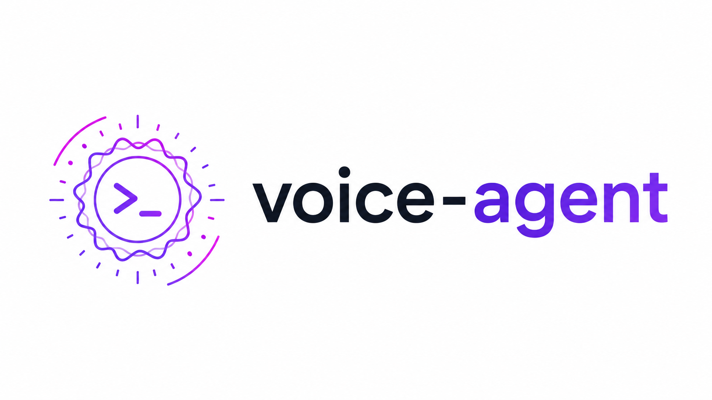
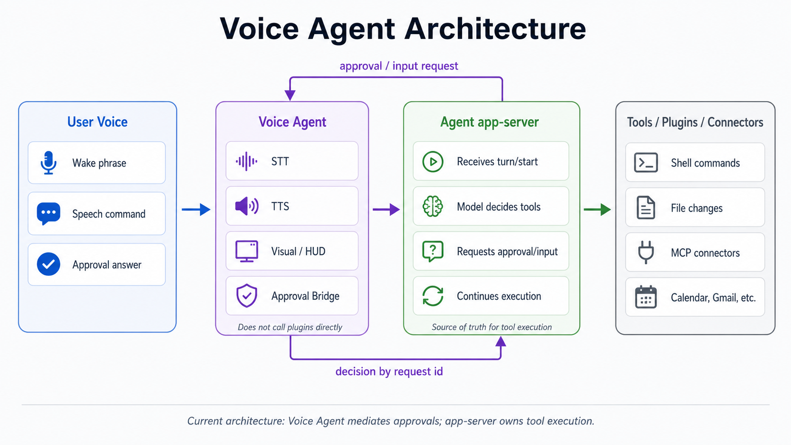
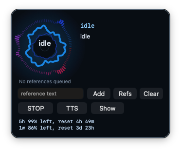

Language / 언어: English | [한국어](./README.ko.md)

# Voice Agent

An always-on voice layer for waking, instructing, hearing, and approving a coding agent hands-free.

[](./LICENSE)



Voice Agent is built around always-on voice interaction for coding agents. A local agent stays ready in the background, listens for your voice, wakes on a phrase, accepts natural Korean or English requests, speaks short responses, and lets you answer approval prompts without touching the keyboard.

The goal is to make an agent feel present in your workflow, not like a command you have to stop and type. Voice Agent keeps the mic pipeline, wake phrase routing, TTS, visual feedback, and approval flow running as a lightweight voice layer around a coding agent.

The current implementation is Codex-focused and macOS-optimized. It listens through the Mac microphone, transcribes Korean/English speech with the local Apple Speech path, routes wake commands to Codex, speaks short responses with Apple TTS, and shows a native visual companion window for listening, thinking, speaking, and approval states.

The local layer is intentionally thin: it handles voice I/O, wake phrases, STT/TTS, visual feedback, and native approval bridging. It does not classify coding intent locally. Normal user commands are passed through to Codex.

## macOS Quick Start

Prerequisites:

- macOS with microphone and speech recognition permissions available.
- Node.js 22 or newer.
- The local `codex` CLI installed and logged in.
- Optional: Qt/QML for the preferred visual companion. If Qt is missing on macOS, the harness falls back to the Swift/AppKit visual companion.

Clone and run the full voice agent:

```sh
git clone git@github.com:yewonkim03dev/voice-agent.git
cd voice-agent
npm run setup:voice
npm run setup:visual
npm run harness:wake:codex -- --visual --tts
```

Then say one of:

```text
hey codex run npm test
hey jarvis refactor the current file
hey jarvis run the test suite
hey jarvis run npm test
```

When Codex asks for permission, answer with `allow`, `deny`, or `allow for session`. The visual approval state keeps the currently supported allow/deny phrases on screen while it waits.

Useful checks:

```sh
npm run tts:test -- --en "Codex voice output test."
npm test
```

## Architecture



Voice Agent is the voice interaction layer around an agent app-server. It turns the user's speech into normal agent input, keeps TTS and visual/HUD state in sync, and mediates approval or input requests by request id. The app-server remains the source of truth for model reasoning, tool selection, plugin calls, connector calls, and execution results.

In the current Codex implementation, plugins installed in the Codex app can be used through Voice Agent. Voice Agent does not call those plugins directly. It forwards STT text to the Codex app-server, then handles the approval or input requests that the app-server sends back, so installed tools, MCP connectors, Google Calendar, Gmail, and similar integrations stay on the official app-server path.

## Floating HUD (macOS)



The native macOS visual companion includes a floating HUD for keeping the voice agent visible without opening the full companion window. It shows the current state, question, recent command output, approval controls, usage status, TTS/STOP/SHOW controls, and reference controls in a compact always-on-top panel.

The HUD can be toggled from the visual settings. The menu bar companion also exposes it, so it can be brought back without restarting the harness.

Pros:

- Keeps listening, thinking, speaking, and approval state visible while another app is in front.
- Makes permission approval and emergency stop reachable without switching back to the terminal.
- Gives a compact place for reference input and queued-reference checks while working in another app.

Tradeoffs:

- It is macOS-specific and depends on the native AppKit visual companion.
- It uses screen space even when compact, so it can cover content in small windows.
- Full-screen behavior depends on macOS window-level and Space behavior; if another app owns a full-screen Space, the HUD may need to be reopened or toggled from the menu bar companion.

## Additional Modes

### Local Mock Harness

Run the local MVP harness with the in-memory backend:

```sh
npm run harness
```

The harness reads one line at a time from stdin, turns normal text into a `Transcript`, and sends it through `RuntimeController` with an in-memory `AgentBackend`. Voice responses are printed to the console instead of using real TTS.

Slash commands simulate Codex-side events in mock mode:

- `/status` prints the current runtime state and Codex status.
- `/permission <command>` creates a mock shell permission request.
- `/complete` sends a mock task-complete event.
- `/error <message>` sends a mock error event.
- `/tts-stop` stops the current TTS output.
- `/quit` stops the session.

### Real Codex App-Server

To connect the terminal harness to a real local Codex app-server:

```sh
npm run harness:codex
```

Codex mode starts `codex app-server --listen ws://127.0.0.1:0`, opens a local websocket JSON-RPC connection, and sends normal text directly with `turn/start`. It does not run local intent classification or text-based permission parsing in front of Codex. This avoids fake approval prompts such as `approve_action`.

Approval and input handling also stays on the app-server protocol path. Voice Agent keeps a pending request by the opaque JSON-RPC id and method, then replies to that same id after the user speaks or chooses a decision. The bridge handles command execution approval, file-change approval, permissions approval, MCP elicitation, and tool user-input requests without branching on a plugin name. If a request supports only one-shot approval, Visual/HUD shows only that choice; unsupported session or persistent approval phrases keep the request pending and ask for a supported answer.

MCP elicitation is rendered as app-server input, not as local connector logic. Form mode displays the server message, fields, required markers, defaults, and enum choices, then returns `accept`, `decline`, or `cancel` using the schema-shaped response expected by app-server. Required form values are filled from schema defaults/const/enum values or explicit user answers; unknown required values are not guessed. URL mode displays the full URL in terminal/visual command output, never opens or fetches it automatically, and provides the URL again only after explicit approval.

On first start, Codex mode stores the returned app-server `threadId` under `codex.threadId` in `.voice-agent.local.json`. Later runs try `thread/resume` with that id before creating a new thread, so repeated `npm run harness:wake:codex -- --visual --tts` sessions continue in the same Codex app chat when the stored thread is still available. To force a specific thread, use `--codex-thread-id <id>` or `VOICE_AGENT_CODEX_THREAD_ID`.

### Structured Voice Responses

Real Codex mode also prepends a voice-agent response protocol prompt. The agent is asked to stream newline-delimited JSON events so short spoken responses can be sent to TTS before the full turn is complete:

```jsonl
{"op":"voice-agent","type":"speech","role":"message","text":"Got it. I will run the tests first."}
{"op":"voice-agent","type":"command","text":"npm test"}
{"op":"voice-agent","type":"speech","role":"progress","text":"The tests are running."}
{"op":"voice-agent","type":"speech","role":"final","text":"The tests finished. Everything passed."}
```

`speech` events may include `role: "progress" | "final" | "message"`. Missing or unknown roles are treated as `message`. `message` is for normal spoken responses, `progress` is for short working updates, and `final` is for final answers or completion summaries. Terminal and visual logs keep every structured event, but TTS may replace stale queued `progress` speech with the newest progress update. `message`, `final`, permission prompts, warnings, errors, and stop confirmations are not dropped as stale progress.

`command` events are displayed but not spoken; keep them for shell commands, file paths, URLs, flags, stack traces, raw logs, or compact execution lists that would be awkward over TTS. `status` is for silent UI state, and `error` is for brief user-facing errors. Invalid or non-JSON output is kept as raw `[agent:stdout]` fallback. If a turn already emitted structured speech, the harness does not add the generic completion TTS on top.

### Active Work And Barge-In

During long Codex work, the harness keeps always-on STT, agent output, and TTS playback separate. While a request is active, background no-transcript STT failures and random non-wake transcripts such as `No` are hidden in default mode, while `--debug` still prints diagnostics. Background noise does not trigger spoken wake-rejected warnings during active work. Wake + stop interrupts the active turn, and wake + a new command cancels stale queued TTS before routing the new request. Late output from an interrupted turn is kept as stale terminal/visual log output, but it is not spoken as fresh speech.

Codex app-server approval requests are routed through native approval handling. Command approvals use the command-specific path, and other `requestApproval` requests are surfaced as generic Codex approval prompts instead of being silently ignored. Unknown JSON-RPC requests receive an explicit error response so the app-server is not left waiting indefinitely.

Always-on wake mode keeps listening while TTS is speaking, but raw VAD activity no longer stops TTS. Candidate speech is transcribed first; if it looks like recent TTS text, it is discarded as echo. During TTS, wake-only speech is ignored, `codex stop` stops speech, and `codex <new command>` stops speech before routing the new command.

### Wake Text Development Mode

Wake text is supported in the terminal as a development stand-in for a real wake detector:

```text
codex run a quick npm test
jarvis run a quick npm test
hey jarvis run npm test
```

The harness strips the wake phrase, for example `codex` or `jarvis`, and forwards the remaining command to Codex. Plain text without a wake phrase is also forwarded for development convenience.

### Native Approval Speech

Native Codex approval requests are printed through the console voice output. While one is pending:

- `yes`, `approve`, `allow`, `go ahead`, or `ok` send a one-time allow decision.
- `no`, `deny`, `reject`, or `cancel` deny the request.
- `allow for session`, `accept for session`, or `always allow` asks Codex for a session-scoped allow when Codex offers that decision.
- `remember this command` asks Codex for a persistent command-policy amendment when Codex offers one.

If the speech is not clearly allow or deny, the harness asks the user to repeat an allow or deny decision and does not forward that utterance to Codex.

In Codex mode, `/permission <command>` is disabled because permissions must come from native Codex app-server approval requests.

Pass extra app-server flags after `--`:

```sh
npm run harness:codex -- -c 'model="gpt-5-codex"'
```

`npm run harness:real` is kept as an alias for `npm run harness:codex`.

### Manual Voice Input

Voice input mode is exposed as:

```sh
npm run setup:voice
npm run harness:voice:codex
```

This mode uses manual recording first so it can later swap `ManualRecordingGate` for a wake/VAD gate without changing STT or agent routing. Type `/record` to start recording and `/record` again to stop. The voice path is:

```text
AudioInput -> ListeningGate -> RecordingController -> UtteranceRecorder -> STT -> Transcript -> Agent pass-through
```

In voice modes, slash commands are still handled by the harness, and plain typed terminal text still routes normally. Use `/add <text>` to queue supplemental context for the next routed STT transcript; queued text is appended under `추가 정보:` and cleared after that routed request.

### Always-On Wake Listening

Always-on wake listening is exposed as:

```sh
npm run harness:wake:codex
```

This starts the same recorder/STT pipeline, but keeps the recorder process running and uses a lightweight VAD gate to cut candidate speech utterances. Each candidate utterance is transcribed once. If the transcript starts with a configured wake phrase, the wake phrase is stripped and the rest is forwarded to Codex. If it does not, the transcript is discarded.

Wake matching first tries exact phrase matching, then a small local prefix-only normalization/fuzzy pass. This catches STT variants like `코 덱스`, `c o d e x`, or `코넥스` without classifying the user command itself.

If a candidate contains only the wake phrase, such as `코덱스`, the runner arms a one-shot follow-up window. The next non-echo utterance is routed as the command without requiring another wake phrase, then the runner returns to normal wake-required listening.

```text
AudioInput -> VAD candidate detector -> STT -> WakePhraseRouter -> Agent pass-through
```

`/record` remains available as a manual fallback in always-on mode. Manual fallback routes the transcript directly through the existing harness, which is useful when debugging wake detection.

### Voice Setup And Wake Phrases

`npm run setup:voice` detects supported local recorder/STT commands and writes `.voice-agent.local.json`. On macOS with `/usr/bin/swift`, setup uses the built-in microphone through AVFoundation and Apple Speech for STT. The file is ignored by git and is read automatically by `npm run harness:voice:codex`.

Voice setup is provider-based: macOS Swift support is the first provider, and Windows/Linux providers can be added without changing `VoiceHarnessRunner`, STT routing, or agent pass-through.

Wake phrases are loaded from `.voice-agent.local.json` or `VOICE_AGENT_WAKE_PHRASES`. The default set is:

```json
[
  "코덱스",
  "클로드",
  "자비스",
  "codex",
  "claude",
  "jarvis",
  "hey codex",
  "hey claude",
  "hey jarvis",
  "헤이 자비스",
  "hey 자비스"
]
```

For example, to customize the list:

```json
{
  "recorderCommand": "exec swift src/audio/macos-record-pcm.swift",
  "sttCommand": "swift src/speech/macos-transcribe.swift {audio}",
  "sampleRate": 16000,
  "channels": 1,
  "wakePhrases": ["jarvis", "hey jarvis", "codex", "hey codex"]
}
```

If auto-detection cannot find a supported command, configure manually with environment variables or by writing `.voice-agent.local.json`:

```sh
export VOICE_AGENT_RECORDER_COMMAND='rec -q -t raw -b 16 -e signed-integer -c 1 -r 16000 -'
export VOICE_AGENT_STT_COMMAND='your-local-whisper-command {audio}'
export VOICE_AGENT_WAKE_PHRASES='jarvis,hey jarvis,codex,hey codex'
```

`VOICE_AGENT_RECORDER_COMMAND` must stream 16kHz mono `pcm_s16le` audio to stdout. `VOICE_AGENT_STT_COMMAND` receives a WAV file path through `{audio}` and should print either plain transcript text or JSON like `{"text":"codex run npm test","language":"en","confidence":0.99}`.

### TTS And Visual Companion

Real TTS output can be enabled with:

```sh
npm run harness:wake:codex -- --tts
```

On macOS, `--tts` defaults to the built-in Apple `AVSpeechSynthesizer` provider. Unsupported platforms keep the console voice output fallback unless a provider is explicitly added later. Console voice lines remain visible even when TTS is enabled.

TTS options can be passed as CLI flags:

```sh
npm run harness:wake:codex -- --tts --tts-voice Yuna --tts-gender female --tts-rate fast
```

To test only TTS without starting Codex:

```sh
npm run tts:test
npm run tts:test -- --en "Codex voice output test."
npm run tts:test -- --voice Samantha --en "Testing a specific voice."
npm run tts:test -- --list-voices
```

The native visual companion UI is Qt/QML-based and does not use a browser, Electron, Tauri, or WebView. To open the companion window by itself:

```sh
npm run visual
```

Visual provider setup prefers Qt/QML, falls back to the native macOS Swift/AppKit companion when Qt is not installed, and prints Qt install commands:

```sh
npm run setup:visual
```

To start the always-on harness with a local visual bridge and companion window:

```sh
npm run harness:wake:codex -- --visual
```

By default, `visual.provider` is `auto`: Qt/QML is used first when `qml6`, `qml`, `qmlscene6`, or `qmlscene` is on PATH; on macOS, missing Qt falls back to `swift visual/macos/VoiceAgentVisual.swift`. You can force a provider with `--visual-provider qtqml` or `--visual-provider macos-native`.

The UI receives state, volume, wake, speech, command, status, error, approval, and context events. After STT completes, `wake_rejected` flashes when the text does not match a configured wake phrase, while `submitting` marks the short handoff from transcript to Codex/Claude before `thinking` or `running`. Speech text is shown near the audio circle with multiline wrapping, and NDJSON `command` events are shown in the command panel without being spoken. The References input sends the same supplemental context as terminal `/add <text>`; it is attached to the next wake-routed request and then cleared, or can be cleared manually with `Clear Ref`. The bottom `TTS Stop` button sends the same control action as `/tts-stop`, and `Exit` requests a full harness shutdown so the terminal session, visual bridge, and Codex/Claude backend are cleaned up together. If a requested visual provider is unavailable, the harness prints `[visual] unavailable: ...` and continues normally.

### TTS Configuration

TTS can also be configured through env:

```sh
export VOICE_AGENT_TTS_ENABLED=true
export VOICE_AGENT_TTS_PROVIDER=macos-apple
export VOICE_AGENT_TTS_VOICE=Yuna
export VOICE_AGENT_TTS_GENDER=female
export VOICE_AGENT_TTS_RATE=fast
```

Or in `.voice-agent.local.json`:

```json
{
  "recorderCommand": "exec swift src/audio/macos-record-pcm.swift",
  "sttCommand": "swift src/speech/macos-transcribe.swift {audio}",
  "sampleRate": 16000,
  "channels": 1,
  "wakePhrases": ["jarvis", "hey jarvis", "codex", "hey codex"],
  "tts": {
    "enabled": true,
    "provider": "macos-apple",
    "language": "auto",
    "gender": "auto",
    "rate": "fast"
  }
}
```

The macOS helper is `src/voice/macos-speak.swift`. It uses `AVSpeechSynthesizer`, selects Korean or English voices from the message language, and can list installed system voices through `npm run tts:test -- --list-voices`.

If either capability is missing, setup prints `[voice:setup]` guidance and the harness prints an exact `[voice:capability]` message before starting Codex.

### Claude Mode

Claude mode is exposed as:

```sh
npm run harness:claude
```

It probes the local `claude` CLI. If the CLI is broken or no supported structured approval transport is available, it prints the exact missing capability instead of pretending to drive Claude through an unsafe PTY shim.

This branch intentionally does not implement production wake-word ML, cloud TTS providers, a third-party PTY dependency, or unsafe text scraping for native approvals. Always-on wake mode uses VAD plus one STT pass per candidate utterance, then discards transcripts that do not start with a configured wake phrase.
